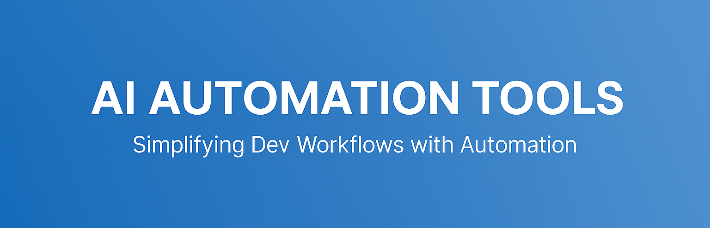

# AI Automation Tools

This repository features a growing collection of **AI-assisted tools** and **automation scripts** built to simplify tasks, optimize workflows, and boost developer productivity.  
Each tool targets real-world technical challenges, aiming to automate manual processes across development, system administration, and beyond.

---

## 📂 Current Tools

### migrate_bootstrap_plugin.sh
- Automates the migration of **Moodle single plugins** from Bootstrap 4 to Bootstrap 5.
- → Speeds up upgrades, minimizes errors, and ensures cleaner transitions.  
*(Generated using Cursor Editor Agent Mode.)*

### migrate_bootstrap_local.sh
- Automates **Bootstrap 4 to 5 migration** for **local Moodle plugins**.
- → Saves time by handling customized components efficiently.  
*(Generated using Cursor Editor Agent Mode.)*

### migrate_bootstrap_customscripts.sh
- Streamlines the migration of **custom scripts** built on Bootstrap 4 to 5.
- → Reduces manual effort and prevents migration errors.  
*(Generated using Cursor Editor Agent Mode.)*

---

## 📈 Why It Matters
Small automation can drive **massive efficiency gains**.  
These tools are designed to eliminate **repetitive work**, allowing developers to focus on **higher-impact tasks**.

---

> ⚡ *Stay tuned: More AI-driven developer tools will be added soon!*

